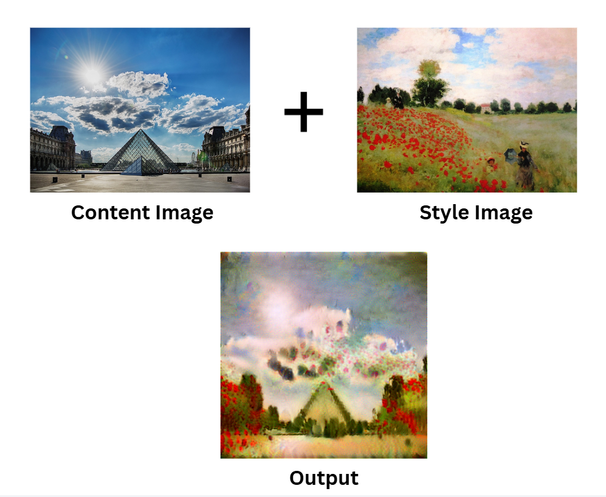

# Neural Style Transfer using VGG19

## Overview
This project implements Neural Style Transfer from scratch using TensorFlow and a pretrained VGG19 network to generate stylized images.

## Features
- Built from scratch in TensorFlow
- Used VGG19 for feature extraction
- Tuned style and content weights (alpha & beta)
- Experimented with randomized initialization

## Tech Stack
Python, TensorFlow, CNN, Computer Vision

## Results

